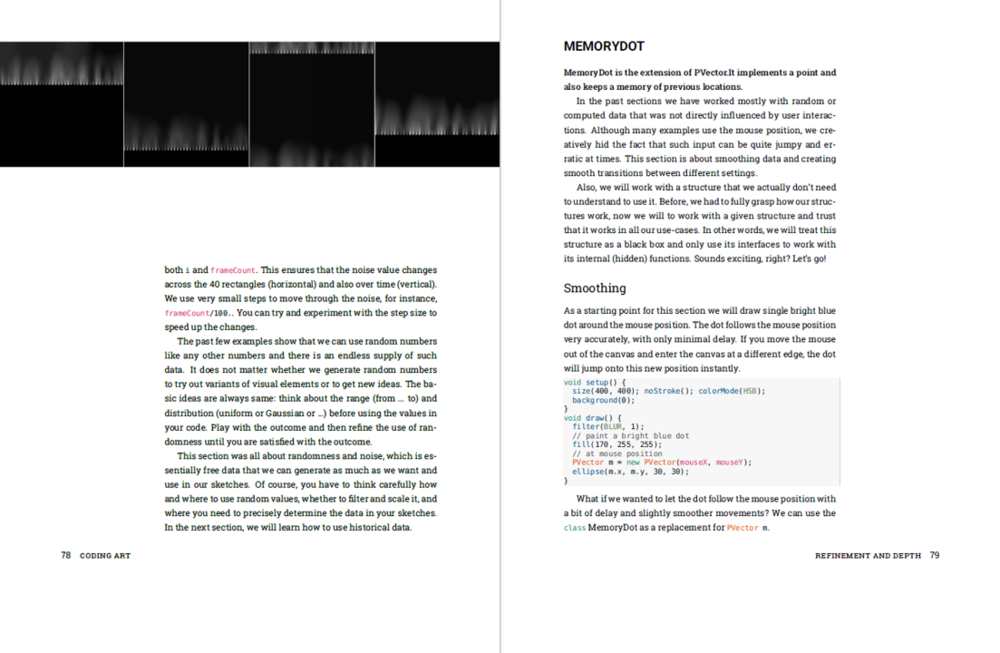
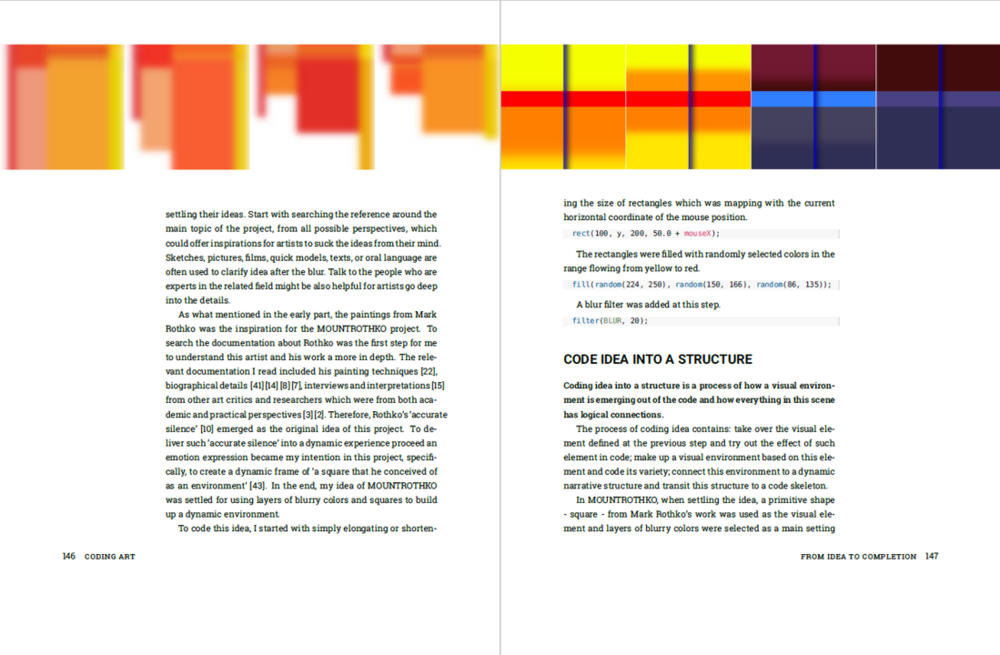

# Coding Art

This the preliminary website for the book "Coding Art" by Yu Zhang and Mathias Funk. The book is currently under expert review and will be released in a few months (or sooner even). We wrote a [Processing example library](/library) that contains all code examples from the book. Also, we are always looking for [feedback](/feedback).

